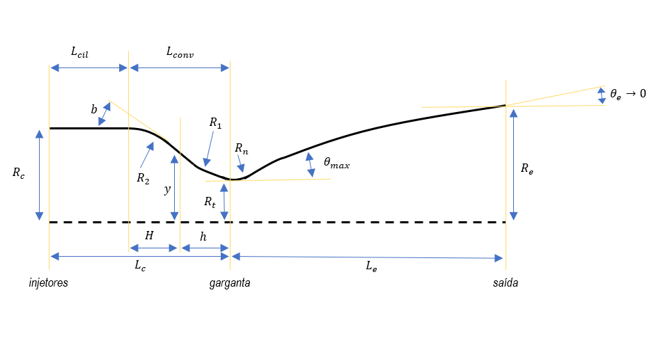
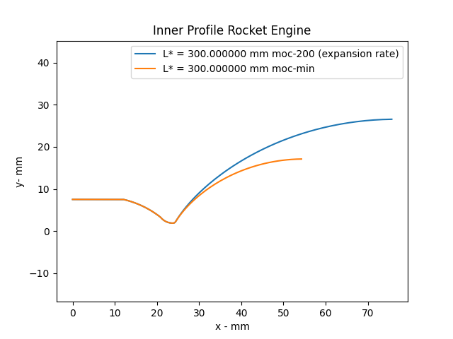

# LPREpy
Python library for internal contour development and performance 
calculations of liquid propellant rocket engines - 
Under Development

## Documentation:
https://github.com/juliomachad0/LPREpy
### Methods
* Initial_Parameters
* Input_Propellant_CEAconfig
* Input_CEA_parameters
* Chamber_Profile
* Nozzle_Profile
* Inner_Profile
### Other classes
* Injectors design (impingement jet, swirl, pintle)
* Characteristic Length Calculation
* Regeneration (jaquet) Cooling calculation